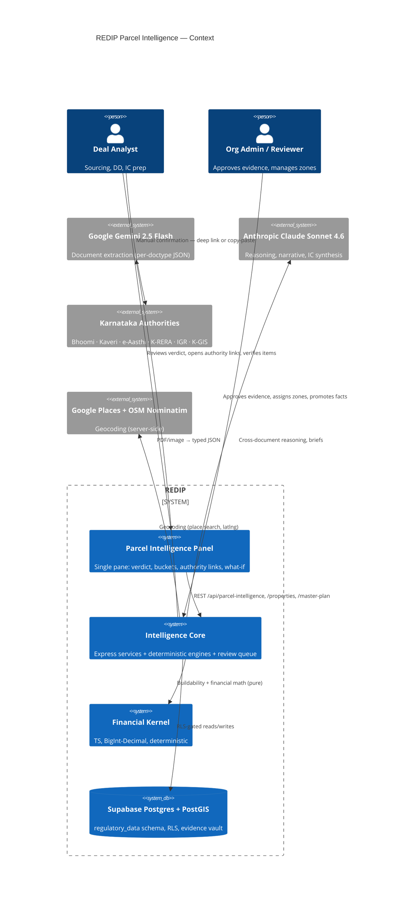
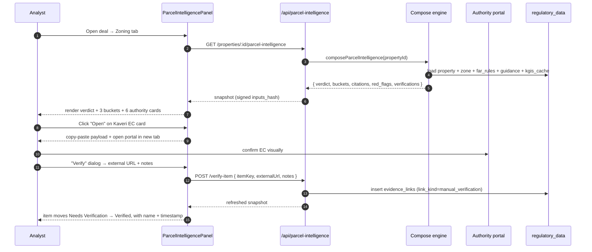

# REDIP Parcel Intelligence — Command Deck

> A trust engine for Karnataka land deals. One pane. Zero fabrication. Every claim traceable.

> **Status (2026-04-28):** Q-now bets **complete** — T4 snapshot signing, T5 red-flag registry, P1/P2/P3 design-system polish. Currently entering **Q-next: Interactive terminal** (T1 what-if sliders → T2 source explorer drawer).
>
> **Read this if** you're new to parcel intelligence, scoping a new feature, or trying to understand *why* a constraint exists. Section 0 is the executive verdict; section 14 is the prioritized roadmap.

---

## 0. Executive verdict (read this first)

**What REDIP's parcel surface is:** a trust engine that turns opaque, authority-siloed Karnataka land data (Bhoomi RTCs, Kaveri ECs, BBMP e-Aasthi khatas, BDA/RMP master plans, IGR guidance values, K-RERA filings, K-GIS cadastrals) into a single signed snapshot per parcel — bucketed as Verified / Inferred / Needs Verification, every fact citing a dated source, every authority deep-linked or copy-paste-loaded for the analyst.

**Why it matters:** in Bengaluru land deals, bad parcel facts destroy more capital than bad financial models. There's no public API for the registry, the master plan, the e-Aasthi portal, or RERA — so the analyst's day is tab-juggling between five government portals, a folder of PDFs, and an Excel sheet. REDIP collapses that into one panel, with provenance and audit baked in.

**Where it stands today:**
- The pipeline is real (Gemini extraction → typed evidence rows → review queue → promote → signed snapshot) and the math is deterministic JS, per CLAUDE.md.
- 27 RMP 2031 Draft FAR rows seeded as global reference; everything else is per-tenant manual upload.
- Six authority cards on the panel. Only K-GIS deep-links; the others are copy-paste payloads (correctly — the rest are CAPTCHA/auth-walled).
- Several frontend polish items (hand-rolled pills, amber divs, inline `var(--*)` styles) drift from the design-system bar.

**Where it should go:** an interactive parcel intelligence terminal — Bloomberg-grade for Indian land — where what-if buildability sliders run client-side off the same pure JS, every fact opens to its PDF page with a bounding-box highlight, the masterplan paints a toggleable GeoJSON overlay on the map, and every snapshot the analyst exports carries a verifiable HMAC signature.

**One-glance mock of the panel today (ASCII):**

```
┌─────────────────────────────────────────────────────────────────────────────┐
│ Parcel Intelligence  ·  Signed snapshot  ·  Confidence 0.74  ·  Refresh ↻   │
├─────────────────────────────────────────────────────────────────────────────┤
│  VERDICT   Reference-matched FAR; setbacks partial; guidance pending review │
│  Next:  [ Verify khata at e-Aasthi ]  [ Open EC at Kaveri ]  [ Map on KGIS ]│
├─────────────────────────────────────────────────────────────────────────────┤
│  Max FAR        Base FAR       Guidance ₹/sqft    Buildable area (screening)│
│   3.25            2.25            13,400           45,720 sqft              │
│   RMP 2031 p.42   RMP 2031 p.42   IGR 2025 p.118   computed                 │
├─────────────────────────────────────────────────────────────────────────────┤
│  [ Verified · 5 ]   [ Inferred · 3 ]   [ Needs Verification · 7 ]           │
│  ─────────────────────────────────────────────────────────────────          │
│  SY 142/3, 142/4   Khata 187/B    Owner R. Krishna   Land 12,580 sqft       │
│  RTC p.1 · 0.94    e-Aasthi p.1   RTC p.1 · 0.91     RTC p.2 · 0.96         │
├─────────────────────────────────────────────────────────────────────────────┤
│  Red flags (2)                                                              │
│   • Additional FAR > 0 — TDR/premium pending authority verification         │
│   • Setback inputs partial — frontage/depth not captured on site            │
└─────────────────────────────────────────────────────────────────────────────┘
```

---

## 1. First principles (why this surface exists)

Strip the surface to four irreducible truths. Every design call follows from them.

| # | Truth | Consequence in code |
|---|---|---|
| 1 | **Karnataka land facts live behind portals without public APIs.** Bhoomi, Kaveri, e-Aasthi, K-RERA, IGR — all CAPTCHA / OTP / login-gated. | Manual blockers preserved. Upload-first. Deep-link when possible (K-GIS), copy-paste payload when not. Never imply live registry connectivity. ([TODO_LEGAL.md](TODO_LEGAL.md)) |
| 2 | **Humans can't eyeball every PDF at scale.** Title chains, ECs, mutations, RMP tables explode in volume on a real deal. | Gemini 2.5 Flash for extraction with per-doctype JSON schemas; **never** for math. ([backend/src/services/extraction.service.js](backend/src/services/extraction.service.js)) |
| 3 | **Trust is the product.** A wrong FAR or a hallucinated owner kills a deal — and a reputation. | Every fact: source, page, confidence, reviewer, effective date. Review queue gates promotion. Snapshots can be HMAC-signed. ([database/migrations/20260425_parcel_intelligence_phase1.sql](database/migrations/20260425_parcel_intelligence_phase1.sql)) |
| 4 | **Speed × accuracy compounds.** Sourcing must work without a parcel name. Underwriting must not stall on missing road width. | Pure deterministic math in [parcelBuildability.js](backend/src/utils/parcelBuildability.js). Truthful "Needs Verification" states. K-GIS adapter, OSM road-width adapter, local what-if sliders — all on the same pure functions. |

**The one-line mission:** *Turn fragmented authority data into one auditable, interactive parcel snapshot — without fabricating a single fact.*

---

## 2. The Trust Engine — system at a glance



**Layer-2 (containers):** the SPA in `frontend/`, the Express function in `api/index.js → backend/src/server.js`, the regulatory_data schema, the AI router, Supabase Storage / Vercel Blob for uploads. RLS isolates orgs; `org_id IS NULL` is reserved for curated global reference rows.

---

## 3. The data spine — opaque PDF → signed snapshot

```mermaid
flowchart LR
    A["Authority artifact<br/>(RMP table, RTC, EC,<br/>khata, IGR PDF)"] -->|signed upload URL| B[(master_plan_documents<br/>+ evidence_sources<br/>status: pending)]
    B -->|POST /documents/:id/extract| C{Gemini 2.5 Flash<br/>per-doctype schema}
    C -->|typed JSON| D[evidenceIngestion.service]
    D --> E[(evidence_facts)]
    D --> F[(far_rules)]
    D --> G[(guidance_values)]
    E -->|review_status='pending'| H[Admin Review Queue]
    F -->|review_status='pending'| H
    G -->|review_status='pending'| H
    H -->|approve| I[Promote evidence_fact<br/>→ properties.* fields]
    H -->|approve| J[Approved far_rules + guidance_values<br/>visible to compose]
    I --> K[parcelIntelligence.composeParcelIntelligence]
    J --> K
    K -->|pure JS| L[selectFarRule<br/>computeBuildabilityFromRule<br/>estimateSetbackImpact]
    K --> M[(kgis_cache)]
    L --> N[(parcel_intelligence_snapshots<br/>+ inputs_hash + source_versions)]
    M --> N
    N --> O[ParcelIntelligencePanel]
    O -->|manual verify| P[(evidence_links<br/>link_kind='manual_verification')]
    P --> N
```



**Three colors of work, in plain English:**
- **Blue (AI):** Gemini extracts; Claude reasons. Neither does math.
- **Purple (Human):** Admin approves/rejects every typed row before it earns the right to be promoted.
- **Green (Deterministic):** FAR selection, buildable area, setbacks, guidance lookup, K-GIS hierarchy — all pure functions, all unit-tested.

---

## 4. The trust pyramid — what the analyst actually sees

```mermaid
flowchart TB
    subgraph TOP["VERIFIED · green fortress"]
        V1[Approved far_rule + page citation]
        V2[Manually verified item via evidence_link]
        V3[Reviewer name + verified_at]
    end
    subgraph MID["INFERRED · amber bridge"]
        I1[Gemini-extracted fact, approved as evidence,<br/>not yet authority-confirmed]
        I2[K-GIS hierarchy match below confidence threshold]
        I3[OSM-inferred road width (proposed)]
    end
    subgraph BOT["NEEDS VERIFICATION · red caution"]
        N1[Additional FAR > 0 — TDR/premium pending]
        N2[Missing road width or frontage]
        N3[Khata/PID/SY missing — authority link disabled]
        N4[Stale snapshot > 30 days]
    end
    BOT -->|"upload + extract + approve"| MID
    MID -->|"manual verification dialog<br/>(external URL or doc)"| TOP
```

**The promise:** every claim sits at exactly one of these tiers, and the tier is visible to the analyst — no hidden uncertainty, no laundered AI guess.

---

## 5. SOP — what an analyst's day looks like on a parcel



**Why this beats tab-juggling today:** the panel keeps the analyst in one surface; every action becomes a row in the audit table; the next person to open the deal sees exactly who verified what, when, and against which authority document.

---

## 6. Architecture Decision Records (ADRs) — why the load-bearing calls were made

Five ADRs, kept short. These are the choices that distinguish REDIP from a generic CRM.

### ADR-1 · Gemini for extraction, Claude for reasoning, deterministic JS for math
**Choice:** Three lanes, never mixed. Routing config in [providerRegistry.js](backend/src/services/ai/providerRegistry.js); pure-JS engine in [parcelBuildability.js](backend/src/utils/parcelBuildability.js).
**Why:** Gemini 2.5 Flash beats Claude on document I/O (PDF-in, JSON-out, lower latency, cheaper); Claude beats Gemini on cross-document reasoning and narrative. Math must never depend on either — a hallucinated FAR coefficient fails CLAUDE.md and kills trust.
**Trade-off accepted:** two SDKs, one telemetry layer ([aiRouter.js](backend/src/services/ai/aiRouter.js) → `ai_call_logs`).

### ADR-2 · Manual blockers preserved end-to-end
**Choice:** Bhoomi / Kaveri / e-Aasthi / K-RERA / IGR are upload-first, deep-link or copy-paste hand-off; never automated CAPTCHA, OTP, or session bypass.
**Why:** [TODO_LEGAL.md](TODO_LEGAL.md) is explicit — automating those portals violates their terms and risks the platform's standing.
**Trade-off accepted:** a slightly slower analyst hop in exchange for a defensible posture in a regulated market.

### ADR-3 · `org_id = NULL` for global curated reference, RLS strict elsewhere
**Choice:** `evidence_sources`, `far_rules`, `guidance_values` allow `org_id IS NULL` curated rows; `kgis_cache` and `parcel_intelligence_snapshots` are strictly tenant-scoped.
**Why:** seeded RMP 2031 Draft rows are valuable to every org, but a tenant's K-GIS lookups and snapshots are theirs alone.
**Trade-off accepted:** a small extra branch in every RLS policy.

### ADR-4 · Pure JS buildability mirrored by a SQL function
**Choice:** `regulatory_data.effective_fsi(...)` exists in Postgres ([20260420_master_plan.sql](database/migrations/20260420_master_plan.sql)) AND in `masterplan.service.calculateEffectiveFSI` AND in `parcelBuildability.computeBuildabilityFromRule`.
**Why:** the SQL function lets indexes/queries pre-filter; the JS keeps the hot path testable; the duplication is deliberate and parity-tested.
**Trade-off accepted:** maintain three call sites in lockstep — guarded by tests.

### ADR-5 · Snapshots are immutable, hashable, signable
**Choice:** `parcel_intelligence_snapshots.inputs_hash` (SHA-256) + `source_versions` JSONB capture exactly which evidence_source/fact/rule versions were used.
**Why:** matches the `deal_events` audit pattern. Future-proofs HMAC signing without a schema migration.
**Trade-off accepted:** snapshots grow; a TTL/sweep job will be needed eventually.

---

## 7. Stack & languages (the boring-but-load-bearing layer)

| Layer | Tech | Path |
|---|---|---|
| Frontend | React 18 · Vite 5 · Tailwind 3 · react-leaflet 4 · Recharts · lucide-react · zustand · @tanstack/react-query · axios | `frontend/` |
| Backend | Node ≥20 · Express 4 (CommonJS, JS only) | `backend/src/` |
| Financial kernel | TypeScript 5.4 · BigInt-Decimal · deterministic | `packages/financial-kernel/` |
| Vercel handler | 5-line wrapper exporting Express app as serverless function | [api/index.js](api/index.js) |
| DB | Supabase-hosted Postgres 14+ · PostGIS · pg_trgm · ref `lsbhrbvuynzqhdtzczco` | `database/migrations/` |
| Storage | Vercel Blob (preferred) OR Supabase Storage `redip-documents` | — |
| Auth | Custom JWT · RLS via `current_organization_id()` claim | [backend/src/middleware/auth.js](backend/src/middleware/auth.js) |
| AI | Gemini 2.5 Flash · Claude Sonnet 4.6 · optional GPT-4o-mini | [backend/src/services/ai/](backend/src/services/ai/) |

[vercel.json](vercel.json) builds the kernel TS → JS at install (`npx tsc -p tsconfig.build.json`), bundles `{backend,packages/financial-kernel/dist}/**`, runs the function at `maxDuration=60s, memory=1024MB`. SPA fallback rewrite. One cron at 03:05 UTC for FX refresh.

---

## 8. Schema — `regulatory_data` (the evidence vault)

| Table | One-liner | Critical columns |
|---|---|---|
| `evidence_sources` | Every uploaded PDF or vendor record | `source_kind`, `authority_name`, `extraction_status`, `review_status`, `confidence_score`, `effective_from/to` |
| `evidence_facts` | Atomic JSONB facts pulled from a source | `source_id`, `fact_type`, `fact_key`, `fact_value`, `page_number`, `confidence_score`, `review_status` |
| `far_rules` | FAR/FSI matrix per zone-band | `zone_code`, `land_use_family`, `plot_area_min/max_sqm`, `road_width_min/max_m`, `base_far`, `additional_far`, `max_far`, setbacks |
| `guidance_values` | IGR/SRO guidance by locality/road | `locality`, `road_name`, `value_inr_per_sqft/_acre`, `effective_from/to` (gin trgm) |
| `kgis_cache` | K-GIS provider response cache | `cache_key`, `survey_numbers`, `hierarchy`, `geometry_geojson`, `expires_at` |
| `parcel_intelligence_snapshots` | The cached compose() output | `inputs_hash`, `output_json`, `source_versions` |
| `master_plan_zones` | Zone catalog | `zone_code`, `permissible_fsi_base/max`, `fsi_road_width_rules`, `setback_rules`, `permissible_uses`, `prohibited_uses` |
| `zone_versions` | Append-only audit of zone amendments | `previous_values`, `change_reason`, `changed_by` |
| `master_plan_documents` | Doc registry tied to extraction | `doc_type`, `extraction_status`, `*_extracted` counters |
| `evidence_links` | Polymorphic verification link | `owner_kind`, `owner_id`, `link_kind`, `external_url`, `verified_by`, `verified_at` |
| `properties` (extended) | Adds `pid`, `khata_no`, `bhoomi_id`, `rera_registration_number`, `frontage_mtrs`, `depth_mtrs`, `geom (PostGIS Point 4326)`, `zone_id` | — |

**Migrations:** 20260420_master_plan, 20260425_parcel_intelligence_phase1 (+ _1_1), 20260425_evidence_ingestion_indexes, 20260426_evidence_links, 20260426_ai_call_logs, 20260427_masterplan_guidance_intake.

**Seed reference data:** 27 RMP 2031 Draft FAR rows (Zones A–B, residential + commercial), confidence=1.0, review_status='approved', org_id=NULL.

---

## 9. Backend code map

| Service | LOC | Role |
|---|---|---|
| [parcelIntelligence.service.js](backend/src/services/parcelIntelligence.service.js) | 665 | Compose orchestrator |
| [parcelIntelligenceAdmin.service.js](backend/src/services/parcelIntelligenceAdmin.service.js) | 1,736 | Review queue, batch promote, authority inputs |
| [parcelIntelligenceVerify.service.js](backend/src/services/parcelIntelligenceVerify.service.js) | 123 | Manual verification → `evidence_links` |
| [masterplan.service.js](backend/src/services/masterplan.service.js) | 812 | Zones CRUD/review, extraction trigger, effective FSI |
| [evidenceIngestion.service.js](backend/src/services/evidenceIngestion.service.js) | 958 | Gemini JSON → typed rows |
| [extraction.service.js](backend/src/services/extraction.service.js) | 1,168 | Per-doctype Gemini orchestration |
| [property.service.js](backend/src/services/property.service.js) | 562 | CRUD + geocoding + area unit normalization |
| [parcelBuildability.js](backend/src/utils/parcelBuildability.js) | 271 | **Pure deterministic math** |
| [parcelVerificationLinks.js](backend/src/utils/parcelVerificationLinks.js) | 223 | Authority deep-links / copy-paste payloads |
| [ai/providerRegistry.js](backend/src/services/ai/providerRegistry.js) | 100 | Provider availability + routing config |
| [ai/aiRouter.js](backend/src/services/ai/aiRouter.js) | — | Telemetry-wrapped dispatch → `ai_call_logs` |

**Routes:** `property.routes.js`, `masterplan.routes.js`, `parcelIntelligence.routes.js`, `evidenceLinks.routes.js`, `extraction.routes.js`.

**Compact API surface (parcel/regulatory only):**

| Method | Path | Purpose |
|---|---|---|
| GET / POST / PUT / DELETE | `/api/properties[/:id]` | CRUD, geocode, bulk-geocode |
| GET | `/api/properties/:id/parcel-intelligence` | Snapshot |
| POST | `/api/properties/:id/parcel-intelligence/refresh` | Recompute |
| GET / POST / DELETE | `/api/properties/:id/parcel-intelligence/verifications[/:linkId]` | Manual verifications |
| GET / POST / PUT | `/api/master-plan/zones[/:id][/review][/versions][/assign-property]` | Zone catalog & audit |
| GET / POST | `/api/master-plan/documents[/:id]/{upload-url\|confirm-upload\|download\|extract}` | Source intake |
| GET / PUT / POST | `/api/parcel-intelligence/{status\|review-queue\|authority-inputs}` | Admin ops, batch promote |

---

## 10. Frontend code map

| File | Role |
|---|---|
| [ParcelIntelligencePanel.jsx](frontend/src/components/deal/ParcelIntelligencePanel.jsx) | Flagship surface: VerdictBanner, ConfidenceMeter, MetricTiles, BucketList, RedFlags, KgisPreview, VerificationLinks, manual-verify dialog |
| [MasterPlanZonePanel.jsx](frontend/src/components/deal/MasterPlanZonePanel.jsx) | Zone picker + facts + site notes |
| [ParcelTab.jsx](frontend/src/components/deal/ParcelTab.jsx) | Deal-detail Parcel tab with property linker + map + geocode |
| [ZoningTab.jsx](frontend/src/components/deal/ZoningTab.jsx) | Composite (MasterPlanZonePanel + ParcelIntelligencePanel) |
| [MasterPlanAdminPage.jsx](frontend/src/pages/MasterPlanAdminPage.jsx) | Zone CRUD + document upload + extraction status |
| [ParcelIntelligenceAdminPage.jsx](frontend/src/pages/ParcelIntelligenceAdminPage.jsx) | Review queue + schema readiness card + batch promote |
| [MapCanvas.jsx](frontend/src/components/map/MapCanvas.jsx) | react-leaflet with property markers, clustering, K-GIS geometry |
| [api.js](frontend/src/services/api.js) | axios client; `Authorization: Bearer` + `X-Organization-Id` interceptors |

State via TanStack Query: `useParcelIntelligence`, `useRefreshParcelIntelligence`, `useParcelVerifications`, `useVerifyParcelItem`, `useUnverifyParcelItem`. Design-system primitives in use: `Card`, `SectionHeader`, `MetricTile`, `StatTile`, `ErrorState`, `Badge`.

---

## 11. AI methodology — the routing matrix

| Task | Provider | Model | Why |
|---|---|---|---|
| Document classification | Gemini | 2.5 Flash | Cheap, fast, JSON-shaped output |
| Document extraction (PDF, image, EC, RTC, RMP, IGR, khata, layout, sanction) | Gemini | 2.5 Flash | `inlineData` base64+mimeType, per-doctype schema |
| Translation (Kannada → English) | Gemini | 2.5 Flash | Multilingual baseline |
| Cross-document reasoning, IC briefs, risk narrative | Claude | Sonnet 4.6 | Long-context, structured reasoning |
| Market synthesis | Claude | Sonnet 4.6 | Same |
| FAR selection, buildable, setbacks, ground coverage | **None** | — | **Pure JS** ([parcelBuildability.js](backend/src/utils/parcelBuildability.js)) — non-negotiable |

Every call wrapped by [aiRouter.js](backend/src/services/ai/aiRouter.js): writes `ai_call_logs` (latency_ms, prompt/completion_tokens, cost_usd, error_code) with lineage to `evidence_source_id` / `document_id` / `deal_id`. That's the observability spine.

---

## 12. Authority verification — the 6-card SOP

[parcelVerificationLinks.js](backend/src/utils/parcelVerificationLinks.js) builds context-aware cards from the property's identifiers:

| Authority | Portal | Deep link? | Inputs needed | Fallback if missing |
|---|---|---|---|---|
| Bhoomi RTC | landrecords.karnataka.gov.in | No (ASPX postback) | survey, district, taluk, hobli, village | "add inputs" badge |
| Kaveri EC | kaveri.karnataka.gov.in | No (auth-walled) | survey, taluk | "add inputs" badge |
| BBMP e-Aasthi | bbmpeaasthi.karnataka.gov.in | No | PID or khata_no | "add inputs" badge |
| IGR Guidance | igr.karnataka.gov.in | Manual | locality | manual link |
| K-RERA | rera.karnataka.gov.in/home/searchProjects | No | rera_registration_number | "add inputs" badge |
| **K-GIS** | kgis.ksrsac.in/cadastral | **Yes** (lat/lng + zoom) | lat, lng | direct map pin |

The "Verify" flow opens a modal, captures external URL + optional document_id + notes, posts to `verifyItem`, writes `evidence_links`, and the next snapshot moves the item to the green tier.

---

## 13. What's *not* there yet — honest gaps

(From [TODO_DATA.md](TODO_DATA.md), [TODO_LEGAL.md](TODO_LEGAL.md), [TODO_MANUAL.md](TODO_MANUAL.md).)

| Gap | Status | What unblocks it |
|---|---|---|
| Survey-level parcel polygons | BLOCKED (no public Karnataka Survey & Settlement API) | Manual GeoJSON upload; Dishaank API access pending |
| Lake / drain / rajakaluve buffers | BLOCKED | Manual GeoJSON; Turf.js spatial intersect |
| EC / RTC / mutation live lookup | BLOCKED (CAPTCHA / OTP / login walls) | Upload + Gemini extract |
| K-RERA verification | BLOCKED (no API) | Manual entry + uploaded evidence |
| BBMP/BDA building approval status | BLOCKED | Upload approval letters |
| OSM road widths | PARTIAL | Overpass adapter (proposed in §14) |
| Karnataka IGR transaction comps | BLOCKED | Manual + broker uploads |
| Kannada handwritten/scanned docs | LOW QUALITY | Translation prompt tuning + reviewer escalation |
| Curated global reference beyond RMP 2031 | THIN | Build seed in §14 |

---

## 14. Roadmap — bets ranked by leverage

Two columns. **Transformative** = changes what the surface *feels* like; **Tactical** = ship in a single PR each, raise the floor.

### 14.1 Transformative bets (each ~1–3 PRs, high leverage)

| # | Bet | Why it transforms the experience |
|---|---|---|
| **T1** | **Live what-if buildability sliders** (road width / frontage / depth) — port `selectFarRule` + `computeBuildabilityFromRule` to a shared util consumed by both backend and the SPA; sliders recompute client-side on the rule set the server returned. | This is the Bloomberg moment. Today the panel is a status report. With sliders it becomes a tool the analyst *plays* with on a call. Zero LLM cost, zero new endpoints. |
| **T2** | **Source Explorer drawer** on every fact — clicking a citation chip opens a side panel with the source PDF page (Supabase signed URL), bounding-box highlight (when Gemini returns one), OCR text, JSON path, confidence, reviewer's notes. | This is the trust layer made visible. Reusable across DD, comps, masterplan — one component shifts the whole platform from "extracted" to "provable." |
| **T3** | **Zoning overlay on `MapCanvas`** — toggleable GeoJSON layer fed from `master_plan_zones.geom`, low-opacity colored fill keyed by permissible FSI; click → opens zone facts panel. | Schema already supports it. Today the map ignores zones entirely. This is the "city as data" moment — and it sets up the lake/buffer overlays cleanly. |
| **T4** ✅ | **Snapshot HMAC signing** — extends `parcel_intelligence_snapshots` with `signature` (HMAC-SHA256 over `inputs_hash \| output_hash \| engine_version`); "Signed" pill on the panel; verify endpoint at `/api/parcel-intelligence/snapshots/:id/verify-signature`. | **Shipped 2026-04-28.** Lets exported reports carry a verifiable signature an investor can re-check. |
| **T5** ✅ | **Red-flag rule registry** — extracted inline red-flag computation into `engines/parcelRedFlags.engine.js`. Registry exposed via `/api/parcel-intelligence/status` and rendered as the `RedFlagRulesCard` admin widget. | **Shipped 2026-04-28.** 11 named, unit-tested, listable rules including the new `snapshot_stale` rule. |
| **T6** | **OSM Overpass road-width adapter** — given lat/lng, query Overpass for `highway=*` near centroid, parse `width`/`lanes`, return a confidence-tagged value. Cache in `osm_road_cache` (mirrors `kgis_cache`). Surface as "OSM-inferred — verify on site." | Road width is the single biggest input gating FAR rule selection. Today, missing it drops the panel into needs-verification hell. This adapter de-risks every Bengaluru parcel without claiming authority. |
| **T7** | **Curated Karnataka reference seed** — extend the global reference layer (`org_id=NULL`) beyond RMP 2031 Draft: BBMP setback bands, BDA layout rules, road-width standards, common land-use families. Each row carries a citation page in an uploaded source. | New orgs see immediate signal without uploading. Doesn't violate "no fabrication" — every row is sourced. |
| **T8** | **Cross-deal locality intelligence** — when one deal's locality has an approved guidance value or verified comp, future deals in the same locality benefit by default (with an attribution chip). | Compounding value. Each deal makes the next one faster. Schema already supports it. |

### 14.2 Tactical PRs (one concern each, raise the floor)

| # | PR | Effort |
|---|---|---|
| P1 ✅ | Replaced 3 hand-rolled status pills (`StatusPill`, `SourceStatusBadge`, `StatusBadge`) with `<Badge tone>` | **Shipped** |
| P2 ✅ | Replaced amber warning divs with `<ErrorState tone="warn">` in `MasterPlanZonePanel`, `ParcelTab`, `ParcelIntelligenceAdminPage` | **Shipped** |
| P3 ✅ | Dropped inline `style={{ color: 'var(--color-text-*)' }}` from `LandingPage.jsx` | **Shipped 2026-04-28** |
| P4 | Daily cron: purge `kgis_cache` past `expires_at`; alert on snapshots > 30 days old | S |
| P5 | AI cost/latency widget on Parcel Intelligence Admin (last-7-day Gemini extract count, p50/p95, total spend, failure rate) | S |
| P6 | Confidence breakdown drilldown — popover lists contributing facts + individual confidence | S |
| P7 | Migration consolidation snapshot (`current_schema.sql`) for new envs after the four 2026-04-25/26/27 migrations are applied to prod | S |
| P8 | Replace inline buildability message strings with i18n-ready keys (groundwork for Hindi/Kannada UI) | M |

### 14.3 Suggested quarterly shape (illustrative)

| Quarter | Theme | Headline ships |
|---|---|---|
| Q-now ✅ | **Trust visible** | T4 (signing) · T5 (red-flag registry) · P1–P3 (polish) — **all shipped 2026-04-28** |
| Q-next 🎯 | **Interactive terminal** | T1 (what-if sliders) · T2 (source explorer drawer) · P5–P6 (observability) |
| Q-after | **Map as data** | T3 (zoning overlay) · T6 (OSM adapter) · T7 (reference seed) |
| Q-after-after | **Compounding** | T8 (cross-deal locality) · investor-grade signed export · stress-test new city onboarding |

---

## 15. Verification — how to ship any of the above safely

For *any* parcel/regulatory PR:

1. `cd backend && npm test` — must pass `parcelBuildability.test.js`, `masterplan.service.test.js`, `evidenceIngestion.service.test.js`, `aiRouter.test.js`.
2. `cd frontend && npm run build` — exits 0; bundle size delta in PR body.
3. Local stack via `powershell -ExecutionPolicy Bypass -File .\run-redip.ps1 fullstack`. Then exercise the chain:
   - Create deal → link property (survey #/PID/khata_no) → upload an RMP PDF → trigger extract → approve a `far_rule` and a `guidance_value` in the review queue → assign zone to property → open Parcel Intelligence panel.
   - Confirm verdict, FAR, buildable, citations populate. Click "Open" on each authority card. Click "Verify" → confirm next snapshot moves item to Verified with analyst name.
4. Schema changes: apply on a Supabase preview branch; confirm via `mcp__supabase__list_tables`; rollback path documented.
5. UI changes: `mcp__Claude_Preview__preview_screenshot` after edits; `preview_console_logs level:error` clean.
6. T4 (signing) specifically: round-trip a snapshot through verify endpoint with a tampered field — must fail.

---

## 16. Critical files (the index)

**Backend orchestrator:** [parcelIntelligence.service.js](backend/src/services/parcelIntelligence.service.js)
**Pure math:** [parcelBuildability.js](backend/src/utils/parcelBuildability.js)
**Verification links:** [parcelVerificationLinks.js](backend/src/utils/parcelVerificationLinks.js)
**Admin queue:** [parcelIntelligenceAdmin.service.js](backend/src/services/parcelIntelligenceAdmin.service.js)
**Masterplan:** [masterplan.service.js](backend/src/services/masterplan.service.js)
**Extraction:** [extraction.service.js](backend/src/services/extraction.service.js), [evidenceIngestion.service.js](backend/src/services/evidenceIngestion.service.js)
**AI routing:** [providerRegistry.js](backend/src/services/ai/providerRegistry.js), [aiRouter.js](backend/src/services/ai/aiRouter.js)
**Schema:** [20260420_master_plan.sql](database/migrations/20260420_master_plan.sql), [20260425_parcel_intelligence_phase1.sql](database/migrations/20260425_parcel_intelligence_phase1.sql), [20260425_parcel_intelligence_phase1_1.sql](database/migrations/20260425_parcel_intelligence_phase1_1.sql), [20260427_masterplan_guidance_intake.sql](database/migrations/20260427_masterplan_guidance_intake.sql), [20260426_evidence_links.sql](database/migrations/20260426_evidence_links.sql)
**Frontend flagship:** [ParcelIntelligencePanel.jsx](frontend/src/components/deal/ParcelIntelligencePanel.jsx)
**Admin pages:** [MasterPlanAdminPage.jsx](frontend/src/pages/MasterPlanAdminPage.jsx), [ParcelIntelligenceAdminPage.jsx](frontend/src/pages/ParcelIntelligenceAdminPage.jsx)
**Deploy:** [vercel.json](vercel.json), [api/index.js](api/index.js), [backend/src/server.js](backend/src/server.js)

---

## 17. What this deck is *not*

- It is **not** a code review — that's the `simplify` skill's job, run on each PR.
- It is **not** a security audit — that's `security-review`, on each PR touching auth/RLS.
- It is **not** an exec dashboard — section 0 is the closest thing; the rest is for the team.
- It is **not** a marketing artifact — there's nothing here you can show an LP without scrubbing.

It *is* the constitution: the load-bearing decisions, the visible map, the prioritized bets. Re-read at the start of any parcel/regulatory work.

---

## Next step (one of)

- **Pick a transformative bet (T1–T8).** I'll write a fresh implementation plan scoped to that single PR (or PR series), with file paths, test plan, and rollback.
- **Pick a tactical batch (P1–P3 etc.).** I'll bundle them into one polish PR if they touch the same surface.
- **Sit on this for a beat.** This deck doesn't expire — it's the reference. Come back to it when the next surface is up for redesign.

This file lives at `C:\Users\rachi\.claude\plans\okay-check-supabase-vercel-snoopy-rose.md`. Move it into `docs/PARCEL_INTELLIGENCE_DECK.md` if you want it to ride with the codebase.
